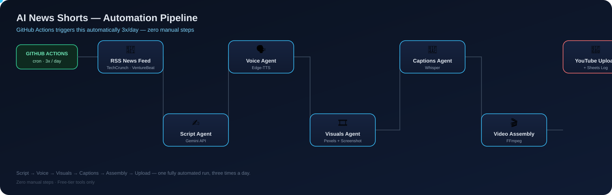

<h1 align="center">📱 AI News Shorts — Automation Pipeline</h1>

<p align="center">
  A fully-automated, faceless YouTube Shorts channel that finds real AI/tech
  news, turns it into a 30-second video, and publishes it — <b>3 times a
  day, with zero manual work</b>, built entirely on free-tier tools.
</p>

<p align="center">
  
</p>

---

## ✨ What this does

Every run, the pipeline:

1. 📡 Pulls a fresh AI/tech news story from RSS feeds (TechCrunch, VentureBeat, AI News)
2. ✍️ Writes a 30-second spoken script for it (Gemini)
3. 🗣️ Narrates it with a natural TTS voice (Edge-TTS)
4. 🎞️ Gathers matching vertical footage — stock video, stock photos with a
   Ken Burns zoom, and a screenshot of the actual source article
5. 💬 Transcribes the narration and burns in short-form captions (Whisper)
6. 🎬 Assembles everything — visuals, voice, captions, background music —
   into a final 1080×1920 video (FFmpeg)
7. 🚀 Uploads it to YouTube with a custom thumbnail, and logs the result to
   Google Sheets

...on a schedule, via GitHub Actions — no server, no laptop needing to stay on.

## 🗂️ Folder structure

```
YOUTUBE ATOMATION SYSTEM/
├── .github/
│   └── workflows/
│       └── publish.yml          # cron schedule — runs the whole pipeline 3x/day
├── agents/
│   ├── script_agent.py          # Step 1 — news → script (Gemini)
│   ├── voice_agent.py           # Step 2 — script → narration (Edge-TTS)
│   ├── visuals_agent.py         # Step 3 — screenshot + stock video/photos (Pexels)
│   ├── captions_agent.py        # Step 4 — narration → burn-in captions (Whisper)
│   ├── video_agent.py           # Step 5 — combines everything into the final .mp4
│   ├── upload_agent.py          # Step 6 — publishes to YouTube + logs to Sheets
│   ├── state/                   # persisted across runs (committed to git)
│   │   ├── recent_topics.json   #   → avoids repeating the same news story
│   │   └── used_visuals.json    #   → avoids repeating the same footage
│   └── output/                  # per-run artifacts (git-ignored — regenerated each run)
├── assets/
│   └── music/                   # royalty-free background tracks (CC0)
├── .env.example                 # template for local API keys
├── .gitignore
├── requirements.txt
├── upload_log.csv               # local backup log of every upload
└── README.md
```

## 🛠️ Tech stack

| Stage | Tool | Cost |
|---|---|---|
| Scheduler | GitHub Actions (cron) | Free |
| Script | Gemini API | Free tier |
| Voice | Edge-TTS | Free |
| Visuals | Pexels API + Playwright (screenshots) | Free |
| Captions | Whisper (local) | Free |
| Assembly | FFmpeg | Free |
| Upload | YouTube Data API v3 | Free |
| Logging | Google Sheets API | Free |

## 🚀 Setup

**1. Install dependencies**
```bash
pip install -r requirements.txt
playwright install chromium
```

**2. Get your free API keys**
- Gemini: https://aistudio.google.com/apikey
- Pexels: https://www.pexels.com/api/

Copy `.env.example` → `.env` and fill in the keys.

**3. YouTube + Google Sheets access**

You'll need a `client_secret.json` (OAuth, for uploading) and a
`service_account.json` (for Sheets logging) from Google Cloud Console, plus
a `token.json` generated by running `upload_agent.py` once locally.

**4. Run the full pipeline locally to test**
```bash
cd agents
python script_agent.py
python voice_agent.py
python visuals_agent.py
python captions_agent.py
python video_agent.py
python upload_agent.py
```

**5. Automate it**

Add these as GitHub repo secrets (Settings → Secrets and variables → Actions):

| Secret | Value |
|---|---|
| `GEMINI_API_KEY` | from `.env` |
| `PEXELS_API_KEY` | from `.env` |
| `GOOGLE_SHEET_ID` | from `.env` |
| `CLIENT_SECRET_JSON_B64` | base64 of `client_secret.json` |
| `TOKEN_JSON_B64` | base64 of `token.json` |
| `SERVICE_ACCOUNT_JSON_B64` | base64 of `service_account.json` |

Then set **Settings → Actions → General → Workflow permissions** to
"Read and write permissions" (the workflow commits state files back after
each run). From there, `.github/workflows/publish.yml` runs automatically
— 7:00 AM, 5:00 PM, and 9:30 PM Colombo time, daily.

## 📝 Notes

- Custom YouTube thumbnails require a phone-verified channel — verify in
  YouTube Studio → Settings → Channel if thumbnails aren't sticking.
- OAuth consent screen must be in **Production** (not Testing) mode, or
  the refresh token expires every 7 days and silently breaks automation.
- `agents/state/` is intentionally tracked in git — it's what stops the
  pipeline from repeating the same news story or the same stock footage
  run after run.

---

<h2 align="center">👋 Author</h2>

<p align="center">
  <b>Hasindu Udara</b><br>
  Software Engineering student · Full-stack developer
</p>

<p align="center">
  <a href="https://www.linkedin.com/in/hasindu-udara">
    
  </a>
  <a href="https://hasinduudara.me/#home">
    
  </a>
  <a href="mailto:hasiduudara@gmail.com">
    
  </a>
</p>